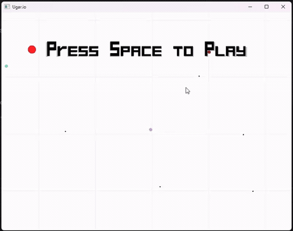

# Ugar.io OpenGL

Simplest single-player copy of Agar.io game, made with C++ and OpenGL.

This project have another implementation with Qt framework: [watch here](https://github.com/ShortKedr-OpenSource/ugar-io-qt).

## Gameplay
[](docs/ugario_gameplay.mov)

## Project Layout
- `src/` contains implementation files
- `include/ugar_io_opengl/` contains project headers
- `resources/` contains Windows resource files and assets
- `CMakeLists.txt` is the primary build entrypoint

## Requirements
1. CMake 3.21 or newer
1. A C++20-capable compiler toolchain
1. Internet access during the first configure so CMake can fetch GLFW
1. OpenGL development libraries for your platform

## Configure and Build
Windows, Linux, macOS:

```bash
cmake -S . -B build
cmake --build build
```

The project now uses CMake as the primary build system and GLFW as the cross-platform window and input layer.
